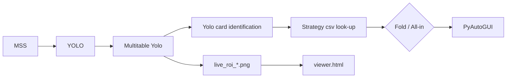
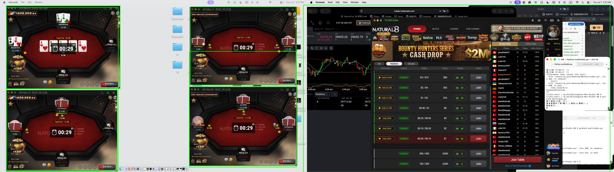

# AutOF - Auto All-In or Fold
```python
python3 -m venv .env
source .env/bin/active
pip3 install -r requirements.txt

# for any of the .py file, rememeber to minimize all other windows before execution, after that would be fine.

# even number of tables only, select "tilt table" at the upperright of the window
# 4-table view 
python3 tile_table.py

# randomly place all the windows
python3 multitable.py

# pyautogui big-picture select region
python3 select_reigon_by_click_multitable.py
```



## How to build your own strategy?
[GTO_AOF](https://github.com/tsungyou/AOF-GTO) for more details.

## By Usage:

<p align="center">
  
</p>