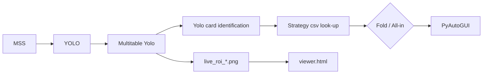

# AutOF - Auto All-In or Fold
```python
python3 -m venv .env
source .env/bin/active
python3 -r requirements.txt
python3 multitable.py
```



## How to build your own strategy?
[GTO_AOF](https://github.com/tsungyou/AOF-GTO) for more details.
